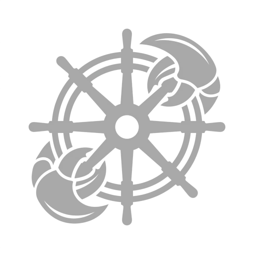

# KClaw



**Kubernetes-native assistant.** This is for when the small business or family needs a Chief of staff and researcher to help navigate there daily life. To bring tools like google email, calendar, drive and office via Personal AI assistant, as well as scripting automation and coding.  Personalized to each user and scales to 30 agents on limited hardware. 

Running in production on k3s (X_86, Graviton, Raspberry PI 5). 
---

## Architecture

```
┌─────────────────────────────────────────────────────────────────────────┐
│  Kubernetes Cluster (openclaw namespace)                                │
│                                                                         │
│  ┌─────────────────┐   ┌───────────────────────────────────────────┐    │
│  │  KClaw Admin UI │   │  Orchestrator                             │    │
│  │  (kclaw-admin-  │   │  - Channels (Slack, Telegram)             │    │
│  │   ui.local)     │   │  - Message routing & Pod lifecycle        │    │
│  │  - Dashboard    │   │  - Task scheduler + CronJob               │    │
│  │  - IAM / RBAC   │   │  - Real-time Observability (K8s Watch API)│    │
│  │  - Tenants      │   │  - Admin API (port 3002)                  │    │
│  │  - Teams        │   └────────────┬──────────────────────────────┘    │
│  │  - MCP servers  │                │ HTTP POST /message                │
│  │  - Vault        │                ↓                                   │
│  │  - Sessions     │   ┌───────────────────────────────────────────┐    │
│  └────────┬────────┘   │  Agent Pod (per user/group)               │    │
│           │            │  - Claude Agent SDK & HTTP server :3000   │    │
│           │ REST       │  - MCP servers (stdio/SSE)                │    │
│           ↓            │  - Local SQLite Storage (gtd.db)          │    │
│  ┌─────────────────┐   │  - POST /reload endpoint                  │    │
│  │  CredRouter     │←──┤  ┌─────────────────────────────────────┐  │    │
│  │  - IAM (JWT)    │   │  │ Shared PVCs (subPath mounts)        │  │    │
│  │  - Tenant vault │   │  │ - Team Skills                       │  │    │
│  │  - Team config  │   │  │ - Private Agent State               │  │    │
│  │  - MCP configs  │   │  └─────────────────────────────────────┘  │    │
│  │  - Token limits │   └───────────────────────────────────────────┘    │
│  └─────────────────┘                                                    │
│                        External APIs: api.anthropic.com, etc.           │
└─────────────────────────────────────────────────────────────────────────┘
```

### Components

| Component | Image | Port | Ingress |
|-----------|-------|------|---------|
| CredRouter | `gryanfawcett/kubeclaw-credrouter:latest` | 3001 (internal) | — |
| Orchestrator | `gryanfawcett/kubeclaw-orchestrator:latest` | 8787, 3002 | `kubeclaw-admin.local` |
| Admin UI | `gryanfawcett/kclaw-admin-ui:latest` | 3003 | `kclaw-admin-ui.local` |
| Agent pods | `gryanfawcett/kubeclaw-agent:latest` | 3000 (internal) | — |

## Requirements

- Ubuntu 26.x Linux on AWS or RasberryPi Bookworm or latter. 
- Kubernetes 1.24+ (tested on k3s on ARM and X86 ) 
- Namespace: `kclaw`
- Orchestrator node selector: `kubernetes.io/hostname` (agents pin to same node for hostPath access)
- Agent pods run as UID 1000 (Claude CLI refuses `--dangerously-skip-permissions` as root)

## Features

**Messaging & Intelligence**

- Slack and Telegram channels
- Wisper flow audio transcription on slack record function ( with api key )
- **Native Document Support:** Full support for `application/pdf` parsing routed dynamically to Claude 3.5/4.x document blocks
- Persistent agent pods — session context kept in memory across messages
- First message: ~35s (pod creation + startup). Subsequent: ~3–5s

**Credential & Config Management (CredRouter)**

- JWT-authenticated admin UI and user portal
- Per-tenant and per-team encrypted vault
- Team-scoped MCP server registry
- Config merge: Global < Team < User
- Credentials delivered to agent pods at startup via ServiceAccount token

**Admin UI** (`http://kclaw-admin-ui.local`)

- Dashboard: health, token spend, active pods, activity feed
- Tenant management: vault, MCP toggles, token budgets, usage charts
- Team management: create teams, assign members, provision PVCs
- Settings: IAM users, team vault, MCP server rack (command/args/url), skill browser
- Sessions: list, inspect, invalidate, kill, **Reload Config** (live credential push)
- IAM: invite flow, RBAC (admin / team_lead / user), SAML SSO

**Data, Storage & Skills**

- Local `gtd.db` (SQLite) per agent pod for durable GTD task tracking
- Team-shared dynamic PersistentVolumeClaims (`subPath` mounts) for private agent state
- Native Skill Repositories loaded seamlessly from folder mappings

**Routing & Observability**

- **Intelligent Notifications:** Automated dispatch and worker routing via Agent Teams
- **Log Streaming:** Real-time cluster logging and observability via the K8s Watch API
- **Strict Security:** Fully hardened against vulnerability chains (npm audits, lock files, Dependabot)
- **Node 22 Baseline:** Entire platform runs on strict Node 22 LTS engines

**Scheduled Tasks**

- Agent uses `ScheduleTask` MCP tool to persist tasks to disk
- UI Task scheduling and Management via team Virtual employee
- `/loop` command working end-to-end

---

## Setting up slack 

#### Go to the [Slack API Portal](https://api.slack.com/apps?new_app=1).

- Click **Create New App** and select **From scratch**.
- Enter your app name G-eves and select your target Slack workspace.
- Click **Create App**. 

- Get the app Token starts with xapp-???????????? and keep it for latter. 

- Scroll back up and click **Install to Workspace**, then authorize the app.
- Goto Oauth & Permission on the right side under Features
- Copy your **Bot User OAuth Token** (`xoxb-...`) and keep it secret.
- Now on the right click the App Manifest to configure your apps behavior. 

- Apply the following app manifest to app.slack.com to your G-eves application to give it permission to talk to the backend 

```
{
    "display_information": {
        "name": "G-eves",
        "description": "Personal AI Assistant"
    },
    "features": {
        "app_home": {
            "home_tab_enabled": false,
            "messages_tab_enabled": true,
            "messages_tab_read_only_enabled": false
        },
        "bot_user": {
            "display_name": "G-eves",
            "always_online": true
        },
        "slash_commands": [
            {
                "command": "/reload",
                "description": "reloads config",
                "should_escape": false
            },
            {
                "command": "/reset",
                "description": "Clears the context",
                "should_escape": false
            }
        ]
    },
    "oauth_config": {
        "scopes": {
            "bot": [
                "users:read.email",
                "channels:history",
                "channels:read",
                "chat:write",
                "commands",
                "files:read",
                "files:write",
                "groups:history",
                "groups:read",
                "im:history",
                "im:read",
                "users:read"
            ]
        },
        "pkce_enabled": false
    },
    "settings": {
        "event_subscriptions": {
            "bot_events": [
                "message.channels",
                "message.groups",
                "message.im"
            ]
        },
        "interactivity": {
            "is_enabled": true
        },
        "org_deploy_enabled": false,
        "socket_mode_enabled": true,
        "token_rotation_enabled": false,
        "is_mcp_enabled": false
    }
}
```

- Go back to Oauth & Permissions and Reinstall your OAuth Token to your org by pressing Reinstall to button. 

## Installing backend

You will need the following:

- AWS access and secret keys for bedrock or anthropic api key
- The Oauth Slack and App slack keys. 
- Brave Search API key
- Option OpenAI key for Wisperflow
- Clone the repo https://github.com/info-struct/kclaw

Run the following command tar -xvf kclaw-installer.tar.gz

cd kclaw

sudo ./install.sh 

## License

**KClaw FSL ALv2" 

- Free for personal and small business use (up to 30 agents/tenents)
- No selling, leasing, or sub-licensing as a standalone product
- Enterprise license required for >30 tenants or commercial SaaS use

See [LICENSE](https://github.com/info-struct/kclaw/blob/main/LICENSE.md) for full terms.
