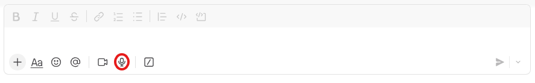

# User Guide 

### Wisper flow setup 

**1. Create an OpenAI account**
\- Go to **[platform.openai.com](http://platform.openai.com)**
\- Sign up with email or Google/Microsoft account

**2. Add billing**
\- Go to **Settings → Billing**
\- Add a credit card and set a usage limit (recommend starting with $10–20/month cap so you don't get surprised)

 **3. Generate an API key**
\- Go to **[platform.openai.com/api-keys**](http://platform.openai.com/api-keys**)
\- Click **"Create new secret key"**
\- Give it a name (e.g. "kclaw-whisper")
\- **Copy it immediately** — OpenAI only shows it once

**4.** Plugin setup you need to plug this api key during install 

#### Using Wisper flow inside of Slack: 

Find the microphone button see blow:

Click record and record up to a 25mb audio file for transcription supported format are mp3, mp4, mpeg, mpga, m4a, wav, webm, flac, ogg, oga according to there website documentation. 

### Shared skills management

K-Claw handles shared skills using Kubernetes volume mounts so all agents in a team see the same tools without rebuilding container images.

• **Storage/PVC Root:** On the actual storage volume, shared skills live at `/mnt/data/shared-skills/`.
• **Agent Pod Mount:** Inside the running K-Claw agent containers, this directory is mounted directly to `/workspace/team-skills/`.
• **Permissions:** For security, the agent pods mount the `team-skills` directory as **Read-Only**. Agents can read and execute the skills, but they cannot modify or delete them. All modifications must be routed through the Admin UI.

⚙️ How to Add and Manage Skills via the Admin UI

Because the agent's `/workspace/team-skills/` directory is mapped directly to the team's Persistent Volume (PVC), you manage everything through the web control panel:

1. **Log in to the Admin UI:** Access your K-Claw web dashboard and navigate to the **Teams** or **Skills Management** section.
2. **Select the Target Team:** Choose the team (e.g., `eng-01`) that needs the new skill or tool.
3. **Upload or Edit the Skill:** Use the UI's deploy tool to upload your new skill file (or edit an existing one). Behind the scenes, the UI securely calls the CredRouter's Admin API (`POST /admin/teams/:team_id/skills`), which writes the file directly into the `/mnt/data/shared-skills/` path on the volume.
4. **Instant Availability:** The moment you click save/deploy in the UI, the file instantly appears in `/workspace/team-skills/` inside the running agent pods.
5. **Force Refresh (Optional):** If a user is already mid-conversation with an agent on Slack, they can type the `/reload` slash command in the chat to force the agent to re-read its configuration and immediately pick up the new skill without losing their chat history.****

### Gmail / google setup 

**Setting Up Gmail and Google Calendar with gog**

Prerequisites: gog CLI installed (v0.37.0+), a Google account, and access to Google Cloud Console at [console.cloud.google.com](http://console.cloud.google.com).

​	**Step 1: Create a Google Cloud Project and OAuth Credentials**

​	Go to [console.cloud.google.com](http://console.cloud.google.com) and create a new project or use an existing one. Enable the Gmail API and Google Calendar 	API under APIs and Services. Then go to APIs and Services, Credentials, and click Create Credentials and choose OAuth client 	ID. Select Desktop app as the application type and download the credentials JSON file.

​	**Step 2: Store the Credentials**

​	Run: gog auth credentials set ~/Downloads/client_secret_xxx.json

​	In headless or agent environments you also need to set: export GOG_KEYRING_PASSWORD="your-password-here"

​	**Step 3: Authorize Your Google Account**

​	Run: gog auth add [you@gmail.com](mailto:you@gmail.com)

​	This opens a browser OAuth flow. Sign in and grant permissions. If you are in a headless environment with no browser 	    	available, add the --manual flag.

​	**Step 4: Set Your Default Account**

​	Run: export GOG_ACCOUNT=you@gmail.com

​	Add this to your .bashrc or environment config to persist it across sessions.

​	**Step 5: Verify It's Working**

​	Test Gmail with asking to run the following command: gog gmail labels list
​	Test Calendar with asking to run the following command with: gog calendar list --days 7

​	For Agent or CI Environments

If you already have a refresh token available as an environment variable, you can skip the browser flow entirely by running: gog auth credentials set /path/to/creds.json followed by: gog auth import --email=you@gmail.com --refresh-token-env=GOOGLE_REFRESH_TOKEN

To check auth status run: gog auth status
To diagnose any issues run: gog auth doctor

### Office365 / Exchange setup 

### Virtual employee SOP  

**How SOPs and Personas Work**
Virtual Employees derive their instructions from a combination of the Persona Registry and shared team SOPs:

• **Persona Registry:** Managed via the Admin UI, a Persona defines the agent's specialized role. When a task is triggered, role-specific instructions are automatically injected into the agent's environment (via `CLAUDE_CODE_ADDITIONAL_INSTRUCTIONS`).
• **Team SOPs (**`/shared/CLAUDE.md`**):** Every team has a shared volume mounted at `/workspace/shared/`. Within this directory, a master `CLAUDE.md` file (or similar documentation) acts as the team's standard operating procedure (SOP). The agent is automatically configured to read this directory on boot, seamlessly merging your documented procedures, coding standards, and workflows into its context.

**Creating and Triggering Tasks**
To put a Virtual Employee to work, Team Managers use the Admin UI to create "Task Templates." A task is simply a database record that links a specific Persona to a prompt (e.g., "Review the latest PRs against our security SOP"). You can trigger these tasks manually for immediate execution or attach them to a schedule for recurring automation. K-Claw handles the heavy lifting by spawning a native Kubernetes Job that boots the agent, executes the prompt using the shared SOPs, and exits cleanly once finished.

**Pro-Tip: Routing Output to Private Slack Channels**
Because Virtual Employees often run asynchronously as background jobs, you need a way to receive their output. When defining a Task Template for a Virtual Employee, you can instruct the agent to send its final report or alert directly to a dedicated, private Slack channel using K-Claw's native Slack integration (e.g., "Once the audit is complete, summarize the findings and send them to the `#ops-alerts` Slack channel"). This creates a clean, automated notification pipeline that keeps your human communication channels uncluttered while ensuring the team always sees the results of the agent's work.

### Team level MCP

Team Managers can manage the team's toolset directly from the web dashboard:

1. **Navigate to Team Tools:** In the Admin UI, select your team and open the **Tools & Integrations** section.
2. **Upload Configurations:** You can upload standard MCP server configuration JSON files or custom local scripts (Python, Node, Bash).
3. **Automatic Routing:** The Admin UI writes these files directly into the team's shared storage path (`/mnt/data/shared/tools/` or `bin/`).
4. **Instant Registration:** Once saved, the files appear in the read-only `/workspace/shared/` directory inside the running agent containers. The agents natively read these configs and register the new tools into their LLM context.
5. **Live Updates:** If a team member is actively chatting with their agent on Slack and a new tool is deployed, they can simply type `/reload`. The agent will instantly refresh its tool registry without losing the conversation history.

**Pro-Tip: Standardized Tools vs. Private State**
You can deploy standardized tool *definitions* team-wide while keeping the actual *execution and data* private. Because the shared MCP configs run locally *inside* each user's isolated pod, any tools that read or write local data will naturally interact with that specific user's private `/workspace/group/` directory. This allows you to deploy universal productivity tools or data-processing scripts to the entire department, while guaranteeing that every user's generated files and databases remain strictly confidential to their own pod.

### The Vault

**How the Vault Works**
In K-Claw, agents should never have direct access to raw API keys or sensitive passwords in plaintext. Instead, K-Claw relies on a centralized Secret, Credential, and Routing Authority known as the **Vault**.

The Vault enables **Credential Blindness**. When an agent needs to authenticate with an external service (like AWS, GitHub, Salesforce, or an LLM provider), it leverages the Vault. The Vault validates the agent's pod identity and uses short-lived session tokens, virtual keys, or proxies the request entirely, ensuring the underlying root secrets are never exposed in the agent's environment or memory.

**Team Secrets vs. Personal Secrets**
The Vault architecture natively understands K-Claw's multi-tenant design:

• **Team Secrets (Shared):** Team Managers can store shared credentials (e.g., a corporate HubSpot API key, a shared AWS IAM role, or a team GitHub token) that apply to an entire "Virtual Department." Any Class B Virtual Employee or Class A Personal Assistant assigned to that team can leverage the integration tool without needing to authenticate individually.
• **Personal Secrets (Isolated):** Individual users can authenticate their own personal services (e.g., a private Google Workspace OAuth token or a personal GitHub PAT). The Vault locks these personal secrets specifically to that user's identity. Even if a user works within a shared team, their personal secrets remain strictly isolated and cannot be accessed by other users or cross-team automations.

**Managing Secrets via the Admin UI**
All secret storage and token lifecycle management (such as OAuth token refreshes) are handled smoothly through the Admin UI:

1. **Navigate to the Vault:** Log into the K-Claw Admin UI and open the **Vault / Credentials** section.

2. **Select Scope:** Choose whether you are adding a credential at the **Global**, **Team** (e.g., `eng-01`), or **Personal** level.

3. **Add the Secret:** Input the API key or trigger the OAuth flow for the desired integration. The Admin UI securely stores this data, encrypting it at rest within the Vault's backend database.

4. **Seamless Agent Execution:** Once saved, you do not need to update agent `.env` files, inject K8s Secrets manually, or restart pods. The next time the agent executes a skill or MCP tool that requires that service, the Vault automatically handles the authentication routing on the fly.

   

### **Using Claude.md and Persona's**

To get the most out of KClaw's persona system, approach the `CLAUDE.md` files as a structured, three-tier memory bank. The **Root-level file** (`/CLAUDE.md`) should be reserved exclusively for core developer instructions, system architecture, and contribution guidelines, as it is mounted read-only across all agent containers. For shared knowledge that needs to be accessible to everyone—such as company-wide facts, standardized workflows, or global operating procedures—use the **Global file** (`/groups/global/CLAUDE.md`), which agents can reference universally and update when explicitly instructed to "remember this globally."

For day-to-day operations, rely heavily on the **Team and Personal-level files** (`/groups/{team_name}/CLAUDE.md`). These serve as the isolated "brain" for each specific channel (e.g., a private chat, a family WhatsApp, or an engineering Slack), storing unique formatting rules, custom trigger behaviors, and local conversation memories. Because these team environments are strictly sandboxed into their own read-write containers, you can highly customize each persona without risking cross-contamination, allowing the main channel agent to act as a lean dispatcher that seamlessly delegates heavy workloads to temporary worker pods.